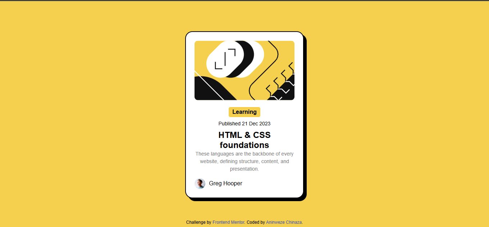

# Frontend Mentor - Blog preview card solution

This is a solution to the [Blog preview card challenge on Frontend Mentor](https://www.frontendmentor.io/challenges/blog-preview-card-ckPaj01IcS). Frontend Mentor challenges help you improve your coding skills by building realistic projects. 

## Table of contents

- [Overview](#overview)
  - [The challenge](#the-challenge)
  - [Screenshot](#screenshot)
  - [Links](#links)
- [My process](#my-process)
  - [Built with](#built-with)
  - [What I learned](#what-i-learned)
  - [Continued development](#continued-development)
  - [Useful resources](#useful-resources)
  - [AI Collaboration](#ai-collaboration)
- [Author](#author)
- [Acknowledgments](#acknowledgments)


## Overview

This is a solution to the Blog preview card challenge from Frontend Mentor.
The goal of this project is to build a responsive blog preview card using HTML and CSS and match the design as closely as possible.

### The challenge

Users should be able to:

- View the blog preview card
- See hover and focus states for all interactive elements on the page
- View the optimal layout depending on their device's screen size (Responsive design).

### Screenshot




### Links

- Solution URL: [Add solution URL here](https://your-solution-url.com)
- Live Site URL: [live site URL ](https://aninweze-chinaza.github.io/blog-preview-card/)

## My process

### Built with

- Semantic HTML5 markup
- CSS custom properties (Variables)
- Flexbox for centering and layout
- Fluid Typography using CSS clamp() function
- Mobile-first workflow (achieved without Media Queries)


### What I learned

During this project, I focused on writing clean, semantic HTML. Instead of using generic div tags, I used structural elements like <article>, and <time> to improve accessibility.

I also learned how to use the clamp() function to create responsive text that scales between a minimum and maximum size automatically:

I also learned how to structure HTML properly and center elements using Flexbox.


```html
<h1>Some HTML code I'm proud of</h1>
```
```css
body { display: flex; justify-content: center; align-items: center; height: 100vh; }
h1{
  font-size: clamp(20px, 5vw, 24px)
}
```


### Continued development

In future projects, I want to dive deeper into:
- CSS Grid: To handle more complex multi-column layouts.
- Accessibility (A11y): Ensuring my color contrasts and screen reader labels are perfect.

### Useful resources

- [MDN Web Docs-Clamp](https://developer.mozilla.org/en-US/): This helped  me understand fluid typography.
- [W3schools](https://www.w3schools.com): A great guide for understanding how shadows works in CSS.

### AI Collaboration

For this project, I collaborated with Gemini as a mentor. We walked through the HTML structure, debated the use of semantic tags like <article> vs <div>, and worked through the logic of viewport units and CSS functions to avoid using traditional media queries.

- What tools I use (e.g., Gemini study-guide, ChatGpt study and learn, GitHub Copilot)?
- I used AI to:
Understand layout structure
Improve HTML and CSS organization
Get explanations of flexbox and styling

- What worked well? The AI helped me learn step-by-step and keep the code simple and clean.


## Author

- Website - [Aninweze Chinaza](https://www.your-site.com)
- Frontend Mentor - [@Aninweze-Chinaza](https://www.frontendmentor.io/profile/Aninweze-Chinaza)
- Twitter - [@Chinaza_An](https://www.twitter.com/Chinaza_An)


## Acknowledgments

Thanks to Frontend Mentor for providing this challenge and helping developers improve their frontend skills.
I also appreciate the learning support and resources that helped me complete this project.
